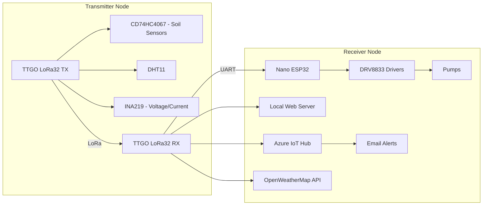

# 🌱 IoT Soil Monitoring & Smart Irrigation System

A complete **LoRa + WiFi based IoT solution** for precision agriculture.  
It measures soil conditions, monitors system health, integrates with the **cloud**, and automatically controls irrigation pumps based on real-time data and weather forecasts.

---

## 📖 Project Description

This project implements a **smart irrigation and soil monitoring system** built around the **TTGO LoRa32 v1.6.1** platform, an **Arduino Nano ESP32**, and multiple sensors.  
The system is designed to help farmers, researchers, and hobbyists **automate irrigation**, **save water**, and **track environmental conditions** remotely.

It consists of two cooperating units that communicate **bi-directionally via LoRa**:

1. **Transmitter Node (Field Unit)**  
   - Collects soil and environment data:
     - Up to **16 soil moisture sensors** via a **CD74HC4067 analog multiplexer**  
     - **DHT11 sensor** for temperature & humidity  
     - **INA219 sensor** for bus voltage and current monitoring  
   - Powered by a **2S LiPo battery (7.4 V nominal)**  
   - Uses an **R-78B5.0-1.5 switching regulator** for efficient 5 V supply  
   - **Connects via UART to an Arduino Nano ESP32 at the field unit**  
     - The **Nano ESP32 generates PWM (0–255)** for irrigation control  
     - Drives **up to 4 pumps** through **2 × DRV8833 motor drivers**  
   - Sends telemetry to the gateway via **LoRa** and **receives pump commands** (PWM setpoints) back from the gateway

2. **Receiver Node (Gateway + Controller)**  
   - Built with **TTGO LoRa32 v1.6.1**  
   - Receives LoRa packets from the field unit (telemetry)  
   - Hosts a **local WiFi web server** for real-time monitoring on the LAN  
   - Connects to **Azure IoT Hub**:
     - Sends telemetry for dashboards  
     - Triggers **email alerts** (e.g., low battery voltage)  
   - Fetches weather data from **OpenWeatherMap API**  
   - Runs irrigation logic:
     - Computes pump **PWM setpoints (0–255)** from soil moisture, temperature, and rainfall forecast  
     - **Transmits PWM commands back over LoRa** to the field unit where the Nano ESP32 drives the DRV8833s
   - **Future expansion**: optional **SIM7000G NB-IoT/LTE module** for cellular connectivity when WiFi is not available

---

## 🛠 Hardware Overview

- **Field Unit (Transmitter + Actuation)**:
  - TTGO LoRa32 v1.6.1
  - **Arduino Nano ESP32 (PWM generation at field)** ← connected to LoRa32 via UART
  - 2 × DRV8833 motor drivers → **4 pumps**
  - CD74HC4067 (16-ch analog mux for soil sensors)
  - DHT11 (temperature & humidity)
  - INA219 (voltage & current monitoring)
  - Power: 2S LiPo → **R-78B5.0-1.5** 5 V regulator
- **Gateway (Receiver + Logic + Cloud)**:
  - TTGO LoRa32 v1.6.1
  - WiFi local web server
  - Azure IoT Hub telemetry + alerts
  - OpenWeatherMap API integration
  - *Planned*: **SIM7000G NB-IoT/LTE** (cellular fallback, optional, gateway or field depending on deployment)
  
---

## 📂 Repository Structure

```
.
├── hardware/             # Schematics, PCB files
├── firmware/             # Source code
│   ├── transmitter/      # Field unit: LoRa32 + Nano ESP32 (PWM to DRV8833)
│   ├── receiver/         # Gateway: LoRa32 (logic, web UI, Azure)
├── cloud/                # Azure IoT Hub setup, dashboards, alerts
├── docs/                 # Documentation, diagrams, pinouts
└── README.md             # This file
```

---

## 🚀 Features

- Collects data from **up to 16 soil moisture sensors**
- Measures **environmental conditions** (temperature, humidity, battery voltage, system current)
- **Bi-directional LoRa**: telemetry uplink (field → gateway) and pump commands downlink (gateway → field)
- Provides a **local WiFi web server** for real-time monitoring
- Integrates with **Azure IoT Hub** for dashboards, logging, and email alerts
- Uses **OpenWeatherMap API** for forecast-based irrigation logic
- Controls **up to 4 water pumps** at the **field unit** with **PWM speed control** (Nano ESP32 → DRV8833)
- Powered by a **2S LiPo battery** with efficient DC-DC regulation
- Includes **overcurrent detection, low-voltage alerts, and watchdog timers**
- **Future-ready**: **SIM7000G** module for **NB-IoT/LTE connectivity** when WiFi is unavailable

---

## 🌐 System Architecture

```mermaid
flowchart LR
  subgraph Field [Transmitter + Actuation (in the field)]
    TX[TTGO LoRa32 TX/RX] --> MUX[CD74HC4067 - Soil Sensors]
    TX --> DHT11[DHT11]
    TX --> INA219[INA219 - Voltage/Current]
    TX <-->|UART| Nano[Nano ESP32 (PWM 0–255)]
    Nano --> DRV8833[2× DRV8833 Drivers]
    DRV8833 --> Pumps[4× Pumps]
  end

  TX <-->|LoRa| RX

  subgraph Gateway [Receiver + Logic + Cloud]
    RX[TTGO LoRa32 RX/TX]
    RX --> WiFi[Local Web Server]
    RX --> Azure[Azure IoT Hub]
    Azure --> Email[Email Alerts]
    RX --> OWM[OpenWeatherMap API]
    %% (Optional future)
    RX -.-> SIM7000G[SIM7000G LTE/NB-IoT (optional)]
  end
```

- **Uplink:** Field → Gateway: soil, env, battery, current.  
- **Downlink:** Gateway → Field: **PWM setpoints** for pumps.

---

## ⚡ Setup & Usage

1. **Assemble Hardware**
   - Field unit: sensors → CD74HC4067 → TTGO LoRa32 (ADC/I²C), DHT11 & INA219 on I²C
   - Field unit: **TTGO LoRa32 ↔ UART ↔ Arduino Nano ESP32**, Nano → DRV8833 → Pumps
   - Gateway: TTGO LoRa32 with WiFi for local web and Azure uplink
   - Power the field unit via **R-78B5.0-1.5** from a 2S LiPo

2. **Upload Firmware**
   - Flash `firmware/transmitter/` to the **field TTGO LoRa32** and the **Nano ESP32**
   - Flash `firmware/receiver/` to the **gateway TTGO LoRa32**
   - Configure `config.h` with LoRa frequency, UART pins/baud, WiFi, and Azure credentials

3. **Cloud Setup**
   - Create Azure IoT Hub device(s)
   - Configure dashboards and alerts (battery voltage, pump state, soil moisture thresholds)
   - Enable email notifications (low voltage, comms timeout, overcurrent)

4. **Run System**
   - Power field & gateway
   - Access local web server at the gateway’s IP
   - View dashboards in Azure
   - Gateway computes irrigation and **sends PWM commands** back to the field unit; **Nano ESP32** drives pumps

---

## 📊 Data Flow

1. Field unit collects data (soil, temp/humidity, battery/current)  
2. **LoRa uplink** to gateway  
3. Gateway merges telemetry with **weather forecast** and computes **PWM setpoints**  
4. **LoRa downlink** to field unit  
5. **Nano ESP32** outputs PWM to **DRV8833** drivers → **Pumps**  
6. Gateway publishes telemetry to **local web** and **Azure IoT Hub**

---

## 🔧 Future Improvements

- [ ] Add **OTA firmware updates** for ESP32 nodes (field + gateway)
- [ ] Replace resistive soil sensors with **capacitive probes** for longer lifespan
- [ ] Implement **data caching** when WiFi/Azure is offline
- [ ] Add **solar charging + BMS** for field autonomy
- [ ] Expand to support **more pumps or irrigation zones**
- [ ] Enable **SIM7000G NB-IoT/LTE cellular fallback** (preferably at the **gateway**, optional at field)

---

## 📜 License

MIT License – free to use and modify. See [LICENSE](LICENSE).

---

## 🙌 Acknowledgments

- [Espressif ESP32](https://www.espressif.com/)
- [Azure IoT Hub](https://azure.microsoft.com/)
- [OpenWeatherMap API](https://openweathermap.org/api)
- [SIM7000G LTE/NB-IoT Module](https://simcom.ee/modules/lte-cat-m/sim7000g/)
- Recom Power – R-78B5.0-1.5 regulator
- Community resources on LoRa, IoT, and smart farming

---

## 🛠 Hardware Overview

- **MCUs & Communication**:
  - 2 × TTGO LoRa32 v1.6.1 (ESP32 + LoRa)
  - 1 × Arduino Nano ESP32
- **Sensors**:
  - 16 × Soil Moisture Sensors (analog, via multiplexer)
  - 1 × DHT11 (temperature + humidity)
  - 1 × INA219 (current & voltage)
- **Drivers & Actuators**:
  - 2 × DRV8833 motor drivers (dual channel → 4 pumps)
- **Power**:
  - 2S LiPo (7.4 V nominal)
  - R-78B5.0-1.5 DC-DC switching regulator (replaces L7805)
- **Support Components**:
  - CD74HC4067 analog multiplexer
  - Bulk capacitors (100 µF ×3, 470–1000 µF at motor rail)
  - Decoupling ceramics (0.1 µF per IC, at regulator, drivers, MCUs)

---

## 📂 Repository Structure

```
.
├── hardware/             # Schematics, PCB files
├── firmware/             # Source code
│   ├── transmitter/      # LoRa32 transmitter node
│   ├── receiver/         # LoRa32 receiver + Nano ESP32
├── cloud/                # Azure IoT Hub setup, dashboards, alerts
├── docs/                 # Documentation, diagrams
└── README.md             # This file
```

---

## 🚀 Features

- Collects data from **up to 16 soil moisture sensors**
- Measures **environmental conditions** (temperature, humidity, battery voltage, system current)
- Transmits sensor data using **LoRa** for long-range, low-power communication
- Provides a **local WiFi web server** for real-time monitoring
- Integrates with **Azure IoT Hub** for dashboards, logging, and email alerts
- Uses **OpenWeatherMap API** for forecast-based irrigation logic
- Controls **up to 4 water pumps** with **PWM speed control**
- Powered by a **2S LiPo battery** with efficient DC-DC regulation
- Includes **overcurrent detection, low-voltage alerts, and watchdog timers**

---

## 🌐 System Architecture



---

## ⚡ Setup & Usage

1. **Assemble Hardware**
   - Connect soil sensors → multiplexer → TX LoRa32 ADC
   - Attach DHT11 and INA219 to TX LoRa32 (I²C bus)
   - Connect DRV8833 → Nano ESP32 PWM pins → Pumps
   - Power everything via the R-78B5.0-1.5 regulator from a 2S LiPo

2. **Upload Firmware**
   - Flash `firmware/transmitter/` to TX LoRa32
   - Flash `firmware/receiver/` to RX LoRa32 + Nano ESP32
   - Configure `config.h` with WiFi SSID, password, LoRa frequency, and Azure credentials

3. **Cloud Setup**
   - Create Azure IoT Hub device
   - Configure dashboards and alerts (battery voltage, pump state, soil moisture thresholds)
   - Enable email notifications

4. **Run System**
   - Power transmitter & receiver
   - Access local web server at the receiver’s IP
   - View dashboards in Azure
   - Pumps will run automatically when soil moisture is low and no rain is forecast

---

## 📊 Data Flow

1. Soil + environment data collected by **Transmitter**  
2. Sent via **LoRa** to Receiver  
3. Receiver publishes data to **local web server** and **Azure IoT Hub**  
4. Azure IoT Hub updates dashboard and triggers **email alerts**  
5. Receiver calculates irrigation needs and controls **pumps via PWM**

---

## 🔧 Future Improvements

- [ ] Add **OTA firmware updates** for ESP32 nodes
- [ ] Replace resistive soil sensors with **capacitive probes** for longer lifespan
- [ ] Implement **data caching** when WiFi/Azure is offline
- [ ] Add **solar charging + BMS** for transmitter autonomy
- [ ] Expand to support **more pumps or irrigation zones**

---

## 📜 License

MIT License – free to use and modify. See [LICENSE](LICENSE).

---

## 🙌 Acknowledgments

- [Espressif ESP32](https://www.espressif.com/)
- [Azure IoT Hub](https://azure.microsoft.com/)
- [OpenWeatherMap API](https://openweathermap.org/api)
- Recom Power – R-78B5.0-1.5 regulator
- Community resources on LoRa, IoT, and smart farming
