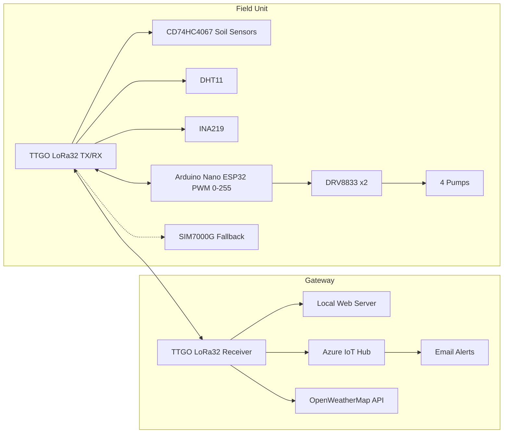
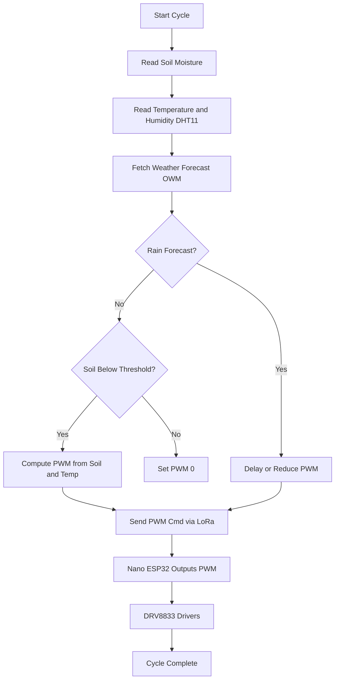
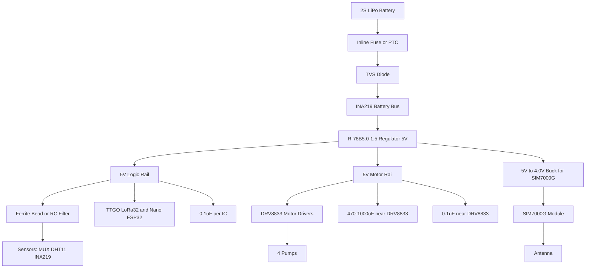

# 🌱 IoT Soil Monitoring & Smart Irrigation System

A complete **LoRa + WiFi + NB-IoT/LTE based IoT solution** for precision agriculture.  
It measures soil conditions, monitors system health, integrates with the **cloud**, and automatically controls irrigation pumps based on real-time data and weather forecasts.

---

## 📖 Project Description

This project implements a **smart irrigation and soil monitoring system** built around the **TTGO LoRa32 v1.6.1** platform, an **Arduino Nano ESP32**, and multiple sensors.  
The system is designed to help farmers, researchers, and hobbyists **automate irrigation**, **save water**, and **track environmental conditions** remotely.

It consists of two cooperating units that communicate **bi-directionally via LoRa**, with **optional NB-IoT/LTE fallback**.

---

## 🌐 System Architecture

- **Primary path:** Field → Gateway → Azure (via LoRa + WiFi).  
- **Fallback path:** Field → Azure (direct via SIM7000G NB-IoT/LTE).  

---

## 💧 Pump Control Logic

**Logic summary:**  
- If **rain is forecast**, irrigation is skipped or reduced.  
- If soil moisture is **above threshold**, pumps remain off.  
- If soil is **below threshold and no rain**, PWM is set based on dryness + temperature.  
- Commands are sent from gateway → field via LoRa (or cached if fallback active).  

---

## 📊 Data Flow

1. Field unit collects data (soil, temp/humidity, battery/current)  
2. Primary: **LoRa uplink → Gateway → Azure**  
3. Backup: **SIM7000G direct uplink → Azure** (if LoRa fails)  
4. Gateway merges telemetry with **weather forecast** and computes **PWM setpoints**  
5. **LoRa downlink** to field unit (Nano ESP32 drives pumps)  
6. Azure IoT Hub updates dashboard and triggers alerts

---

## 🔧 Future Improvements

- [ ] Add **OTA firmware updates** for ESP32 nodes (field + gateway)
- [ ] Replace resistive soil sensors with **capacitive probes** for longer lifespan
- [ ] Implement **data caching** when WiFi/Azure is offline
- [ ] Add **solar charging + BMS** for field autonomy
- [ ] Expand to support **more pumps or irrigation zones**
- [ ] Finalize **SIM7000G NB-IoT/LTE fallback** logic at the field unit for robust direct-to-cloud telemetry

---

## 📜 License

MIT License – free to use and modify. See [LICENSE](LICENSE).

---

## 🙌 Acknowledgments

- [Espressif ESP32](https://www.espressif.com/)
- [Azure IoT Hub](https://azure.microsoft.com/)
- [OpenWeatherMap API](https://openweathermap.org/api)
- [SIM7000G LTE/NB-IoT Module](https://simcom.ee/modules/lte-cat-m/sim7000g/)
- Recom Power – R-78B5.0-1.5 regulator
- Community resources on LoRa, IoT, and smart farming

---

## 🔋 Power Management

**Notes:**
- **Fuse/PTC** on battery + for safety; **TVS diode** for transient protection.
- **R-78B5.0-1.5** feeds both logic and motor rails; add **10–47 µF at VIN** and **10–22 µF at VOUT** + **0.1 µF ceramics** close to pins.
- **Ferrite bead + 10–47 µF + 0.1 µF** create a **clean analog sensor rail** off the 5 V logic branch.
- **DRV8833 rail** needs **470–1000 µF bulk** + **0.1 µF** near the driver.
- **SIM7000G** typically needs **~4.0 V** with **high current peaks**; use a **dedicated buck** plus local bulk (e.g., 470–1000 µF low-ESR) if you add cellular at the field unit.
