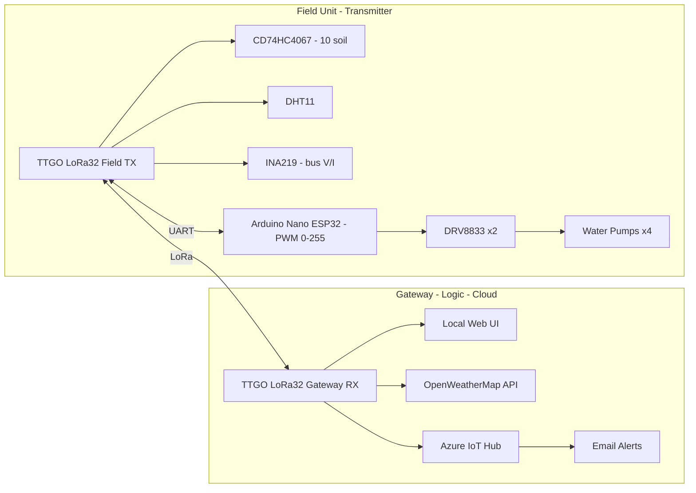
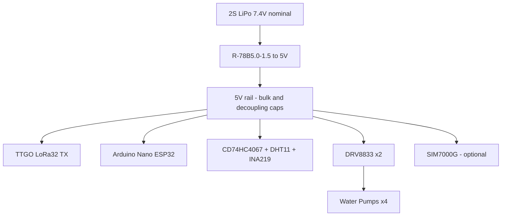
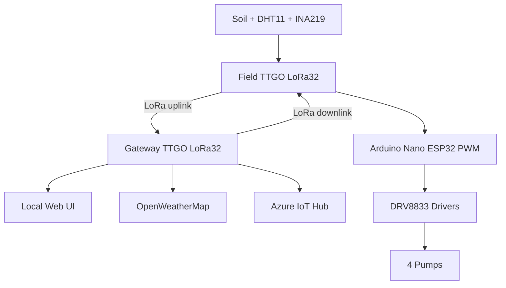

# Smart Irrigation & Soil Monitoring System

## Project Description
This project implements a smart irrigation and soil monitoring system built around the **TTGO LoRa32 v1.6.1**, an **Arduino Nano ESP32** and multiple sensors. It automates irrigation, saves water and tracks environmental conditions remotely.

The system consists of **two cooperating units** communicating bi-directionally via **LoRa**. The gateway hosts a local web UI and connects to **Azure IoT Hub**. The field unit can be expanded to **16 soil sensors** via an analog multiplexer (currently 10 used). Weather data is fetched from **OpenWeatherMap**. Pump PWM (0-255) is computed at the gateway and sent to the field; the field forwards PWM to a **Nano ESP32** over UART which drives **2× DRV8833** motor drivers (4 pumps total). Power is provided by a **2S LiPo (7.4 V)** regulated to **5 V** with a **Recom R-78B5.0-1.5**.

---

## Topology

---

## Power Flow (Field Unit)

**Capacitors (field):**
- Bulk: 3 × 100 µF on 5 V rail + 470–1000 µF near DRV8833 rail.
- Decoupling: 0.1 µF at each IC.
- SIM7000G (optional): additional ≥ 1000 µF low-ESR at modem rail.

---

## Pump Control Logic

- Field unit reads sensors and relays data; it does not compute irrigation.
- Gateway computes PWM for four pumps based on:
  - Weather temperature and rain forecast (OpenWeatherMap).
  - Per-pump soil moisture cutoffs.
  - Lockout after pump turns off (default 10 min).
  - Manual override timeout (default 20 min).
  - Max temperature limit (`maxPumpTemp`).
- Gateway sends: `P,<d0>,<d1>,<d2>,<d3>` with 0–255 duty over LoRa.
- Field LoRa32 forwards UART to Nano ESP32; Nano outputs PWM to DRV8833.

---

## Data Flow

---

## Hardware Summary

**Field Unit**
- TTGO LoRa32 v1.6.1 (SX1276, ESP32)
- CD74HC4067 (16-ch analog MUX; 10 soil sensors in use)
- DHT11 (temperature & humidity)
- INA219 (bus voltage/current)
- Arduino Nano ESP32 (ESP32-S3) over UART from LoRa32
- 2 × DRV8833 motor drivers (4 pump channels)
- Power: 2S LiPo (7.4 V) → **R-78B5.0-1.5** → 5 V for logic and drivers
- Optional: SIM7000G NB-IoT/LTE

**Gateway Unit**
- TTGO LoRa32 v1.6.1
- Local web server (Wi‑Fi)
- Azure IoT Hub (telemetry, twin, email alerts)
- OpenWeatherMap API

---

## Firmware Notes (selected)

**Field Nano ESP32 (PWM receiver)**
- UART RX pin: 18 (to TTGO TX GPIO4)
- UART TX pin: 17 (optional ACK)
- Baud: 115200
- PWM pins: 5, 6, 7, 8
- PWM: 5 kHz, 8-bit (0–255)
- Command format: `P,<d0>,<d1>,<d2>,<d3>`
- Fail-safe: stop all pumps if no command within 5000 ms

**Gateway (receiver + logic)**
- Parses CSV uplink from field (soil[10], t,h,v,i,p)
- Computes auto PWM by soil groups:
  - Pump1: avg(1,2) ; Pump2: avg(3,4) ; Pump3: avg(5,6,7) ; Pump4: avg(8,9,10)
- Enforces per-pump cutoff percentage with lockout
- Manual override auto-return after configured duration
- Weather gating: blocks or reduces irrigation if rain expected or temp > `maxPumpTemp`
- Sends LoRa downlink with 4 PWM bytes to field

**Web UI**
- Real-time dashboard (200 ms refresh)
- Controls:
  - Per-pump enable/disable
  - Manual/auto with 0–100% override
  - Moisture cutoff per pump (0–100%)
  - Lockout and manual durations (ms)
  - Max temperature limit
  - Location set (city or lat,lon)
- Basic Auth for mutating endpoints

**Azure IoT Hub**
- MQTT over TLS (DigiCert Global Root G2)
- Telemetry payload includes soil[], air T/H, bus V/I/P, pumps[], durations, rain flag, maxTemp
- Direct methods for pump enable, overrides, cutoffs, durations, maxTemp, and location
- Reported/desired twin sync

---

## Timers and Thresholds (defaults)
- Lockout after cutoff reached: 10 min (configurable)
- Manual override timeout: 20 min (configurable)
- Max temperature limit: 22.0 °C (persisted; adjustable)
- Command watchdog on Nano ESP32: 5 s

---

## License
MIT

---

## Credits
Espressif ESP32 • TTGO LoRa32 • CD74HC4067 • DRV8833 • INA219 • DHT11 • Recom R‑78B5.0‑1.5 • Azure IoT Hub • OpenWeatherMap
