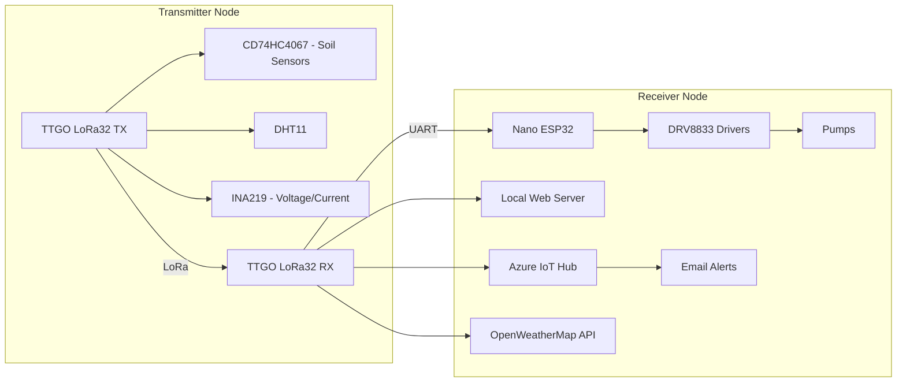

# 🌱 IoT Soil Monitoring & Smart Irrigation System

A complete **LoRa + WiFi based IoT solution** for precision agriculture.  
It measures soil conditions, monitors system health, integrates with the **cloud**, and automatically controls irrigation pumps based on real-time data and weather forecasts.

---

## 📖 Project Description

This project implements a **smart irrigation and soil monitoring system** built around the **TTGO LoRa32 v1.6.1** platform, an **Arduino Nano ESP32**, and multiple sensors.  
The system is designed to help farmers, researchers, and hobbyists **automate irrigation**, **save water**, and **track environmental conditions** remotely.

It consists of two cooperating units:

1. **Transmitter Node (Field Unit)**  
   - Collects soil and environment data:
     - Up to **16 soil moisture sensors** via a **CD74HC4067 analog multiplexer**  
     - **DHT11 sensor** for temperature & humidity  
     - **INA219 sensor** for bus voltage and current monitoring  
   - Powered by a **2S LiPo battery (7.4 V nominal)**  
   - Uses an **R-78B5.0-1.5 switching regulator** for efficient 5 V supply  
   - Transmits compact data packets via **LoRa** to the receiver node  

2. **Receiver Node (Gateway + Controller)**  
   - Built with **TTGO LoRa32 v1.6.1** + **Arduino Nano ESP32**  
   - Receives LoRa packets from the transmitter  
   - Hosts a **local WiFi web server** for real-time monitoring on the LAN  
   - Connects to **Azure IoT Hub**:
     - Sends telemetry for dashboards  
     - Triggers **email alerts** (e.g., low battery voltage)  
   - Fetches weather data from **OpenWeatherMap API**  
   - Runs irrigation logic:
     - Calculates pump PWM values (0–255) based on soil moisture, temperature, and rainfall forecast  
     - Controls up to **4 pumps** through **2 × DRV8833 motor drivers**  
   - Sends pump commands via **UART** to the Nano ESP32, which generates PWM signals  

---

## 🛠 Hardware Overview

- **MCUs & Communication**:
  - 2 × TTGO LoRa32 v1.6.1 (ESP32 + LoRa)
  - 1 × Arduino Nano ESP32
- **Sensors**:
  - 16 × Soil Moisture Sensors (analog, via multiplexer)
  - 1 × DHT11 (temperature + humidity)
  - 1 × INA219 (current & voltage)
- **Drivers & Actuators**:
  - 2 × DRV8833 motor drivers (dual channel → 4 pumps)
- **Power**:
  - 2S LiPo (7.4 V nominal)
  - R-78B5.0-1.5 DC-DC switching regulator (replaces L7805)
- **Support Components**:
  - CD74HC4067 analog multiplexer
  - Bulk capacitors (100 µF ×3, 470–1000 µF at motor rail)
  - Decoupling ceramics (0.1 µF per IC, at regulator, drivers, MCUs)

---

## 📂 Repository Structure

```
.
├── hardware/             # Schematics, PCB files
├── firmware/             # Source code
│   ├── transmitter/      # LoRa32 transmitter node
│   ├── receiver/         # LoRa32 receiver + Nano ESP32
├── cloud/                # Azure IoT Hub setup, dashboards, alerts
├── docs/                 # Documentation, diagrams
└── README.md             # This file
```

---

## 🚀 Features

- Collects data from **up to 16 soil moisture sensors**
- Measures **environmental conditions** (temperature, humidity, battery voltage, system current)
- Transmits sensor data using **LoRa** for long-range, low-power communication
- Provides a **local WiFi web server** for real-time monitoring
- Integrates with **Azure IoT Hub** for dashboards, logging, and email alerts
- Uses **OpenWeatherMap API** for forecast-based irrigation logic
- Controls **up to 4 water pumps** with **PWM speed control**
- Powered by a **2S LiPo battery** with efficient DC-DC regulation
- Includes **overcurrent detection, low-voltage alerts, and watchdog timers**

---

## 🌐 System Architecture



---

## ⚡ Setup & Usage

1. **Assemble Hardware**
   - Connect soil sensors → multiplexer → TX LoRa32 ADC
   - Attach DHT11 and INA219 to TX LoRa32 (I²C bus)
   - Connect DRV8833 → Nano ESP32 PWM pins → Pumps
   - Power everything via the R-78B5.0-1.5 regulator from a 2S LiPo

2. **Upload Firmware**
   - Flash `firmware/transmitter/` to TX LoRa32
   - Flash `firmware/receiver/` to RX LoRa32 + Nano ESP32
   - Configure `config.h` with WiFi SSID, password, LoRa frequency, and Azure credentials

3. **Cloud Setup**
   - Create Azure IoT Hub device
   - Configure dashboards and alerts (battery voltage, pump state, soil moisture thresholds)
   - Enable email notifications

4. **Run System**
   - Power transmitter & receiver
   - Access local web server at the receiver’s IP
   - View dashboards in Azure
   - Pumps will run automatically when soil moisture is low and no rain is forecast

---

## 📊 Data Flow

1. Soil + environment data collected by **Transmitter**  
2. Sent via **LoRa** to Receiver  
3. Receiver publishes data to **local web server** and **Azure IoT Hub**  
4. Azure IoT Hub updates dashboard and triggers **email alerts**  
5. Receiver calculates irrigation needs and controls **pumps via PWM**

---

## 🔧 Future Improvements

- [ ] Add **OTA firmware updates** for ESP32 nodes
- [ ] Replace resistive soil sensors with **capacitive probes** for longer lifespan
- [ ] Implement **data caching** when WiFi/Azure is offline
- [ ] Add **solar charging + BMS** for transmitter autonomy
- [ ] Expand to support **more pumps or irrigation zones**

---

## 📜 License

MIT License – free to use and modify. See [LICENSE](LICENSE).

---

## 🙌 Acknowledgments

- [Espressif ESP32](https://www.espressif.com/)
- [Azure IoT Hub](https://azure.microsoft.com/)
- [OpenWeatherMap API](https://openweathermap.org/api)
- Recom Power – R-78B5.0-1.5 regulator
- Community resources on LoRa, IoT, and smart farming
